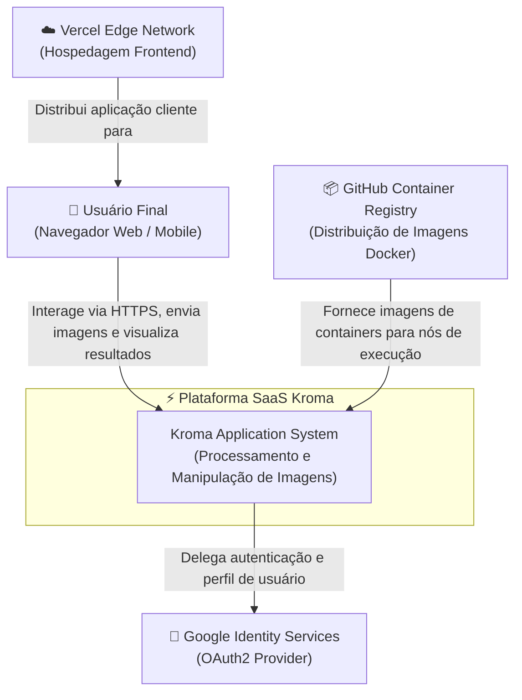
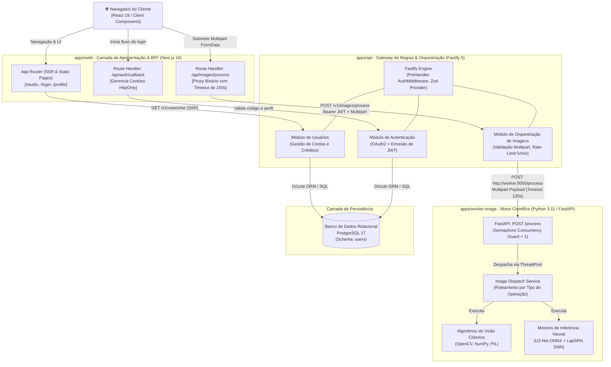
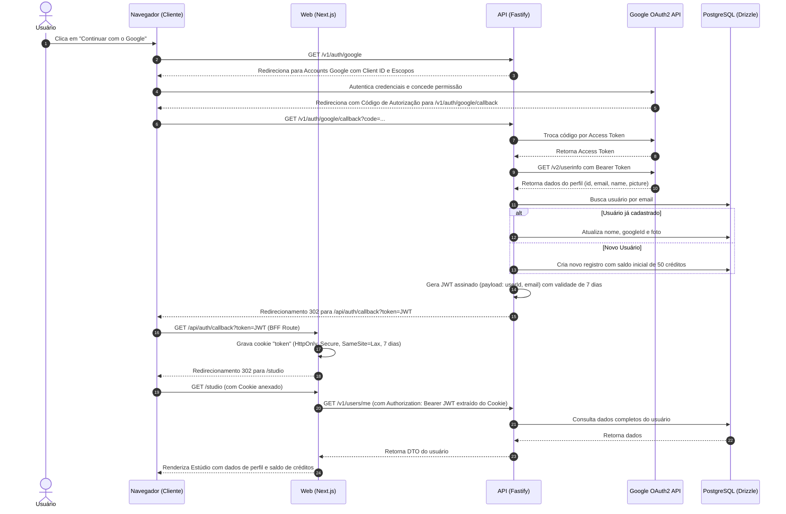
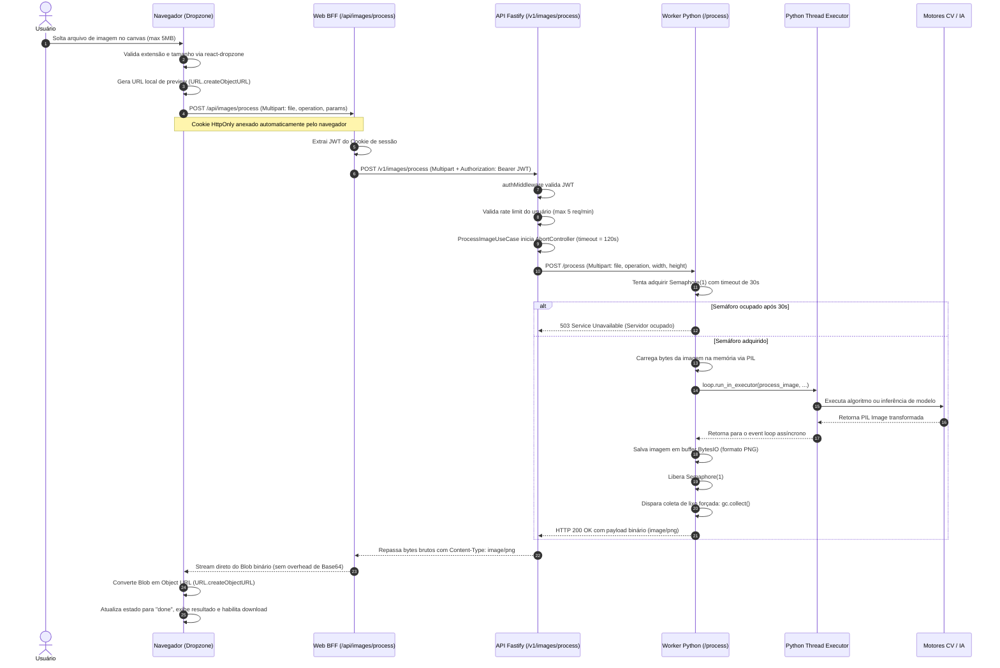
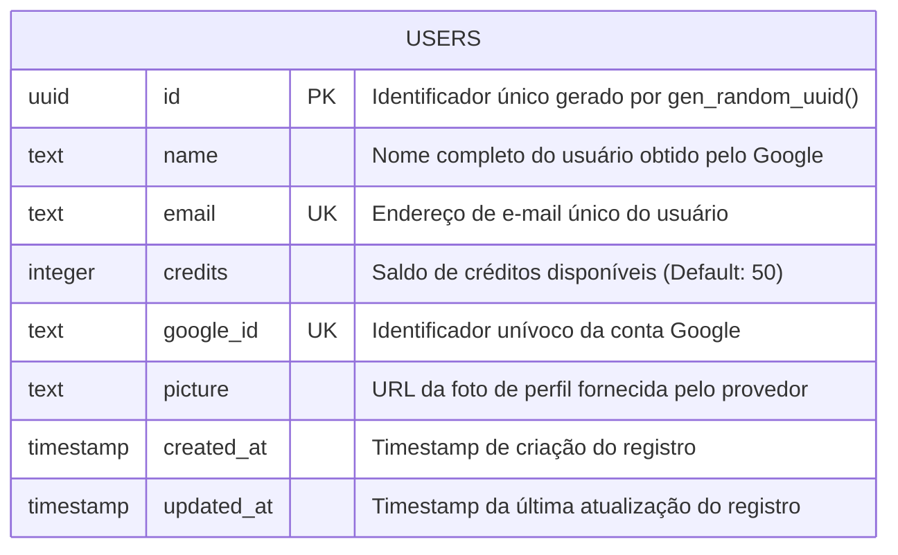
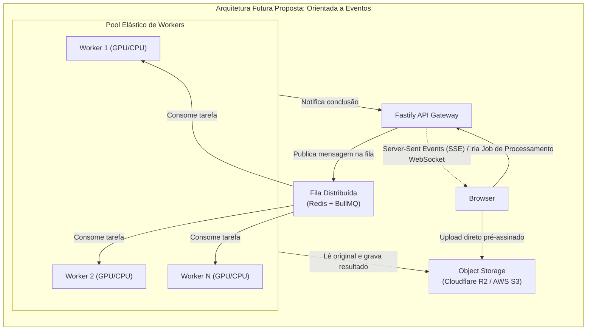

# Documento de Arquitetura do Sistema (Architecture Overview)

Este documento apresenta a especificação técnica detalhada e abrangente da arquitetura do ecossistema **Kroma**, uma plataforma SaaS orientada ao processamento, aprimoramento e manipulação de imagens por meio de Visão Computacional e Inteligência Artificial.

O objetivo deste documento é servir como a **única fonte da verdade (SSOT)** para engenheiros de software, arquitetos e agentes autônomos, detalhando os princípios de design, padrões estruturais, comunicação entre serviços, ciclo de vida de dados, pipelines de CI/CD e requisitos não funcionais que sustentam o produto.

---

## 1. Visão Geral e Propósito do Sistema

O **Kroma** foi projetado para fornecer um estúdio de edição de imagens com velocidade de nível profissional, foco na experiência do usuário e alta fidelidade visual. A aplicação combina manipulações clássicas de visão computacional (redimensionamento de alta fidelidade, filtros de cor, ajustes de nitidez) com modelos profundos de aprendizado de máquina (remoção de plano de fundo e super-resolução por IA).

### 1.1. Principais Diretrizes Arquiteturais
- **Segregação de Responsabilidades (SoC):** Separação estrita entre o roteamento/orquestração de regras de negócio em Node.js e o processamento intensivo de matrizes e tensores numéricos em Python.
- **Resiliência a Travamento de Event Loop:** Nenhuma computação pesada de pixels é executada na camada Node.js, garantindo que o Gateway de API mantenha latência milimétrica em I/O.
- **Proteção contra Falhas por Exaustão de Memória (OOM):** Controle estrito de concorrência via semáforos assíncronos no motor Python, assegurando que o consumo de RAM permaneça estável sob cargas severas.
- **Eficiência de Payload de Rede:** Eliminação de codificação/decodificação Base64 redundante em trânsito; transferência direta de streams binários (`Blob` / `Buffer` / `image/png`) de ponta a ponta.
- **Segurança Defensiva em Camadas:** Autenticação delegada via Google OAuth2, isolamento de credenciais no navegador através de cookies `HttpOnly` e autorização por tokens JWT nas fronteiras entre serviços.

---

## 2. Estrutura do Monorepo

O repositório é organizado no formato monorepo utilizando **pnpm workspaces** para o ecossistema JavaScript/TypeScript e **uv** para o ambiente Python.

```text
[Project Root]
├── .docker/                            # Armazenamento local persistente para containers de desenvolvimento
│   └── postgres/                       # Volume local do banco PostgreSQL
├── .github/                            # Automação de CI/CD e governança de código
│   ├── workflows/
│   │   ├── ci.yml                      # Testes automatizados, linting e deploy na Vercel
│   │   └── docker.yml                  # Build multi-stage e publicação de imagens no GHCR
│   └── dependabot.yml                  # Monitoramento e atualização automática de dependências
├── .agents/                            # Habilidades especializadas e manuais para agentes de engenharia
├── apps/
│   ├── web/                            # Aplicação Frontend & Camada BFF (Next.js 16 App Router)
│   │   ├── public/                     # Assets estáticos, ícones de redes sociais e tipografia
│   │   ├── src/
│   │   │   ├── app/                    # Rotas do Next.js (App Router)
│   │   │   │   ├── (public)/login/     # Fluxo de login e interface de boas-vindas
│   │   │   │   ├── (protected)/studio/ # Editor, layout do estúdio e rotas dinâmicas de ferramentas
│   │   │   │   │   ├── [tool]/page.tsx # Roteamento dinâmico baseado no slug da ferramenta
│   │   │   │   │   ├── resize/page.tsx # Página especializada em proporções de aspecto
│   │   │   │   │   └── _components/    # Seções especializadas do editor (sidebar, header, canvas)
│   │   │   │   ├── api/                # Handlers de rota BFF (Backend-for-Frontend)
│   │   │   │   │   ├── auth/callback/  # Coleta de token e persistência em cookie seguro
│   │   │   │   │   └── images/process/ # Proxy reverso de streaming binário para a API Fastify
│   │   │   │   ├── globals.css         # Variáveis de tema e estilos fundamentais do Design System
│   │   │   │   └── layout.tsx          # Shell raiz da aplicação
│   │   │   ├── components/             # Primitivas de UI acessíveis (baseadas em Radix UI / Shadcn)
│   │   │   ├── contexts/               # Provedores React de contexto global (UserContext)
│   │   │   ├── hooks/                  # Custom hooks utilitários (responsividade e mobile)
│   │   │   ├── lib/                    # Configurações de domínio (tools.ts, resizes.ts, socials.ts)
│   │   │   ├── resources/              # Serviços de comunicação do cliente e do servidor (auth, image, user)
│   │   │   └── middleware.ts           # Interceptor de segurança de rotas do Next.js
│   │   ├── Dockerfile                  # Containerização de produção Standalone
│   │   └── package.json                # Dependências do frontend
│   │
│   ├── api/                            # Gateway de Negócios e Orquestrador (Fastify 5 + TypeScript)
│   │   ├── src/
│   │   │   ├── config/                 # Módulos de configuração desacoplados (CORS, JWT, Rate-limit, OAuth)
│   │   │   ├── controllers/            # Controladores HTTP (User, Auth, Image)
│   │   │   ├── database/               # Camada de persistência Drizzle ORM
│   │   │   │   ├── migrations/         # Arquivos de migração SQL versionados
│   │   │   │   ├── schema/             # Definição tipada de tabelas (users.schema.ts)
│   │   │   │   ├── connection.ts       # Pool de conexões do driver postgres-js
│   │   │   │   └── index.ts            # Ponto de exportação do cliente de dados
│   │   │   ├── factories/              # Injeção de dependências e fábricas de casos de uso
│   │   │   ├── middlewares/            # Interceptores de autenticação (auth.middleware.ts)
│   │   │   ├── models/                 # Tipos de domínio inferidos e DTOs
│   │   │   ├── repositories/           # Implementações e contratos de acesso ao banco (Repository Pattern)
│   │   │   ├── routes/                 # Registro modular de rotas REST
│   │   │   ├── usecases/               # Casos de uso de aplicação isolados (Clean Architecture)
│   │   │   └── server.ts               # Ponto de entrada, plugins Fastify e encerramento gracioso
│   │   ├── Dockerfile                  # Build multi-stage Alpine para produção
│   │   ├── drizzle.config.ts           # Configuração de migração e Drizzle Studio
│   │   └── vitest.config.ts            # Configuração de suíte de testes de unidade
│   │
│   └── worker-image/                   # Motor Especializado de Computação Visual (Python 3.11 + FastAPI)
│       ├── app/
│       │   ├── processor/              # Algoritmos de visão computacional e pipelines de IA
│       │   │   ├── color.py            # Modificadores cromáticos e saturação
│       │   │   ├── effects.py          # U2-Net (rembg), cartoon, desenho a lápis, pintura a óleo
│       │   │   ├── enhance.py          # Unsharp Mask e filtros de nitidez
│       │   │   ├── resize.py           # Redimensionamento adaptativo Lanczos
│       │   │   ├── transform.py        # Espelhamento e transformações afins
│       │   │   └── upscale.py          # Super-resolução profunda via LapSRN (x2 e x4)
│       │   ├── services/
│       │   │   └── image_service.py    # Dicionário de despacho e roteamento de operações
│       │   ├── utils/
│       │   │   └── image_loader.py     # Decodificação segura de bytes para imagens PIL/OpenCV
│       │   └── main.py                 # Servidor FastAPI, semáforo de concorrência e lifecycle
│       ├── scripts/
│       │   └── download_models.py      # Automação de download dos modelos pré-treinados
│       ├── Dockerfile                  # Container otimizado com modelos pré-embarcados
│       └── pyproject.toml              # Declaração do projeto Python gerenciado via uv
├── docs/                               # Documentação técnica e manuais de engenharia
│   └── architecture.md                 # Este documento de arquitetura
├── AGENTS.md                           # Orientações operacionais para agentes de IA
├── docker-compose.yml                  # Orquestração do ambiente completo de infraestrutura local
└── package.json                        # Scripts globais do monorepo
```

---

## 3. Diagramas Arquiteturais de Alto Nível

### 3.1. C4 Model - Nível 1: Diagrama de Contexto de Sistema

Este diagrama ilustra o posicionamento da plataforma Kroma em relação aos usuários finais e atores externos integrados.



---

### 3.2. C4 Model - Nível 2: Diagrama de Contêineres

Detalhamento dos componentes de software que formam a arquitetura interna do Kroma, seus protocolos de comunicação e responsabilidades de execução.



---

### 3.3. Diagrama de Sequência: Autenticação Segura de Ponta a Ponta

Fluxo detalhado da autenticação via Google OAuth2, geração de sessão delegada e garantia de isolamento do token no navegador via cookie protegido.



---

### 3.4. Diagrama de Sequência: Processamento e Transformação de Imagens

Fluxo síncrono e de streaming de alto desempenho demonstrando a passagem da imagem desde o drop do usuário até o retorno do stream binário para a memória do navegador.



---

## 4. Detalhamento dos Componentes Centrais

### 4.1. Camada Frontend & BFF (`apps/web`)

Construído sobre o ecossistema moderno do **Next.js 16 (App Router)** e **React 19**, utilizando **Tailwind CSS v4** e primitivas de acessibilidade do **Radix UI**.

- **Padrão Backend-for-Frontend (BFF):**
  - O frontend atua não apenas como cliente de renderização, mas como uma camada de segurança e adaptação de protocolos.
  - As rotas em `src/app/api/*` interceptam o ciclo de autenticação e mascaram os tokens de segurança. Os tokens JWT nunca são persistidos em `localStorage` ou `sessionStorage`, eliminando completamente o risco de exfiltração de credenciais via ataques XSS (*Cross-Site Scripting*).
  - O manipulador `src/app/api/images/process/route.ts` recebe os dados do formulário do cliente, injeta o token Bearer recuperado do cookie seguro e atua como um proxy reverso com streaming de resposta.

- **Otimização de Memória e Transporte Binário:**
  - Em versões legadas ou soluções ingênuas de edição de imagem, utiliza-se comumente strings em Base64. A representação em Base64 introduz uma sobrecarga de ~33% em tamanho de payload e consome ciclos pesados de CPU no navegador para codificação e decodificação de strings massivas.
  - No Kroma, a camada de transporte opera exclusivamente com **blobs binários puros**. A resposta da API é encapsulada em um `Blob` do navegador e convertida em um identificador de memória volátil via `URL.createObjectURL(blob)`. Quando o usuário limpa o canvas ou substitui a imagem, invoca-se explicitamente `URL.revokeObjectURL()` para desalocação imediata da memória gráfica.

- **Catálogo de Ferramentas e Presets:**
  - O sistema define uma matriz de operações estruturadas em `src/lib/tools.ts`, `src/lib/resizes.ts` e `src/lib/socials.ts`.
  - São suportadas 13 ferramentas dedicadas:
    1. `remove-background`: Remoção inteligente de fundo via U2-Net (10 créditos).
    2. `ai-upscale`: Super-resolução 2x baseada em rede LapSRN (5 créditos).
    3. `cartoon`: Estilização artística com quantização cromática (2 créditos).
    4. `pencil-sketch`: Simulação de desenho manual com hachuras (2 créditos).
    5. `oil-painting`: Efeito pictórico com convolução de Gabor (2 créditos).
    6. `sharpen`: Nitidez de alta frequência por Unsharp Mask (1 crédito).
    7. `grayscale`: Conversão tonal para escala de cinza (1 crédito).
    8. `blur`: Desfoque Gaussiano ajustável (1 crédito).
    9. `saturate`: Realce dinâmico do canal de saturação HSV (1 crédito).
    10. `flip-horizontal`: Espelhamento axial horizontal (1 crédito).
    11. `flip-vertical`: Inversão axial vertical (1 crédito).
    12. `sepia`: Transformação matricial vintage (1 crédito).
    13. `vignette`: Escurecimento gradiente radial das bordas (1 crédito).
  - Presets de Proporção Social com dimensões nativas para Instagram, TikTok, YouTube, LinkedIn, Pinterest, Twitter/X, Facebook e Twitch.

---

### 4.2. Camada API & Gateway de Orquestração (`apps/api`)

Implementada com **Fastify 5**, **TypeScript** e **Drizzle ORM**. O Fastify foi selecionado por apresentar desempenho significativamente superior ao Express (até 4x mais requisições por segundo e menor alocação de memória por contexto de requisição).

- **Estrutura Baseada em Clean Architecture:**
  - **Routes (`src/routes/`):** Declaração de endpoints, mapeamento de métodos e associação de schemas de validação.
  - **Controllers (`src/controllers/`):** Recepção de requisições, extração de parâmetros e serialização da resposta de saída.
  - **Usecases (`src/usecases/`):** Encapsulamento estrito das regras de negócio. Totalmente desacoplados de frameworks de transporte (não conhecem `FastifyRequest` ou `FastifyReply`), o que permite testes unitários puros e reutilização universal.
  - **Repositories (`src/repositories/`):** Abstração de persistência implementada através do padrão *Repository Pattern* (`IUserRepository`), viabilizando a troca de infraestrutura de dados ou mockagem sem impacto nas regras de negócio.
  - **Factories (`src/factories/`):** Módulos de composição responsáveis por instanciar a cadeia de dependências de cada controlador.

- **Proteção Perimetral e Resiliência:**
  - **Taxa Limite de Requisições (@fastify/rate-limit):**
    - Escopo global: 15 requisições por minuto por IP ou ID de usuário autenticado.
    - Escopo de processamento (`/v1/images/process`): Teto rígido de **5 requisições por minuto**, prevenindo abusos e sobrecarga na fila do worker.
  - **Teto de Carga Útil (@fastify/multipart):**
    - Limite máximo estrito de **5MB** por arquivo. Requisições que excedam o valor são rejeitadas na borda antes de alocarem memória.
  - **Timeouts Estratégicos:**
    - O caso de uso `ProcessImageUseCase` configura um `AbortController` com tempo limite de **120.000 ms (2 minutos)** para cobrir tanto o processamento quanto eventuais partidas a frio (*cold starts*) de containers do worker.
  - **Encerramento Gracioso (Graceful Shutdown):**
    - Utilização de `close-with-grace` para interceptar sinais do sistema operacional (`SIGINT`, `SIGTERM`), aguardando o encerramento das requisições em trânsito e fechando o pool de conexões com o PostgreSQL antes do encerramento do processo.

---

### 4.3. Motor de Processamento Científico & IA (`apps/worker-image`)

Serviço desenvolvido em **Python 3.11** utilizando **FastAPI**, **Uvicorn**, **OpenCV (contrib headless)**, **Pillow (PIL)**, **rembg** e **NumPy**.

- **Estratégia de Concorrência Segura (OOM Prevention):**
  - O processamento de imagens e redes neurais consome grandes matrizes tridimensionais na memória RAM (uma imagem 4K descompactada em formato float pode atingir centenas de megabytes em matrizes intermediárias).
  - Para garantir estabilidade absoluta, o worker implementa uma trava estrita de concorrência:
    ```python
    processing_lock = asyncio.Semaphore(1)
    ```
  - **Timeout de Fila:** Se uma nova requisição chegar enquanto uma imagem já estiver sendo processada, ela aguarda a liberação do semáforo por até **30 segundos** (`SEMAPHORE_TIMEOUT`). Caso o recurso não seja liberado a tempo, o worker responde com HTTP `503 Service Unavailable`, informando sobrecarga momentânea sem que o processo seja finalizado por falta de memória.
  - **Execução Desacoplada da Thread Principal:** Como a manipulação de matrizes do OpenCV e a inferência de IA são operações que bloqueiam a CPU (*CPU-bound*), elas não são executadas no event loop assíncrono. Em vez disso, o worker delega a tarefa a um pool de threads nativo via:
    ```python
    loop = asyncio.get_event_loop()
    result_image = await asyncio.wait_for(
        loop.run_in_executor(None, process_image, image, operation, params or None),
        timeout=PROCESSING_TIMEOUT # 120 segundos
    )
    ```
  - **Limpeza Agressiva de Memória:** Ao final de cada ciclo de processamento no bloco `finally`, invoca-se explicitamente o coletor de lixo do Python (`gc.collect()`), devolvendo blocos de memória não referenciados ao sistema operacional.

- **Ciclo de Vida de Modelos (Lazy Loading & Descarregamento Dinâmico):**
  - O modelo de remoção de plano de fundo **U2-Net** (~170MB de tensores ONNX) e os modelos de super-resolução **LapSRN** (~1MB a ~4MB) utilizam o padrão de *Carregamento Sob Demanda*.
  - A instância do modelo só é inicializada na primeira vez em que a operação é solicitada.
  - As rotas contam com a opção `unload_after=True`. Quando ativado, os ponteiros globais de sessão (`_session` e `_sr_instance`) são zerados e a memória é limpa imediatamente após a geração do resultado, viabilizando arquiteturas de escala zero (*Scale-to-Zero*) em ambientes de nuvem serverless/containers.

- **Destaques dos Algoritmos de Visão e Efeitos:**
  - **Cartoon Avançado:** Combinação de filtro bilateral (`cv2.bilateralFilter`) para atenuação de textura com preservação de arestas; quantização de cores acelerada através de miniatura com **K-Means** e projeção via **KDTree** (`scipy.spatial.cKDTree`); elevação de saturação no espaço de cores HSV em 40%; e máscara de contornos por limiarização adaptativa (`cv2.adaptiveThreshold`).
  - **Pencil Sketch (Desenho a Lápis Realista):** Aplicação da técnica clássica de fusão *Color Dodge* (inversão da escala de cinza e divisão pelo desfoque Gaussiano invertido); contraste adaptativo CLAHE; injeção de 5 camadas de hachura direcional em ângulos distintos (30°, 60°, 80°, 120°, 150°); e fusão textural de micro-ruído de grafite e granulação de papel artesanal.
  - **Oil Painting (Pintura a Óleo):** Suavização pictórica inicial; filtro especializado `cv2.xphoto.oilPainting`; adição de pinceladas anisotrópicas direcionais através de convoluções com **filtros de Gabor**; redistribuição tonal no espaço de cores perceptual **LAB**; e compressão de realces para conferir peso de tinta óleo.

---

## 5. Armazenamento de Dados & Modelagem

A persistência do ecossistema é centralizada no **PostgreSQL 17**, gerenciado através do **Drizzle ORM** com tipagem estática e suporte a migrações determinísticas.

### 5.1. Configuração do Pool de Conexões (`apps/api/src/config/database.config.ts`)
- **Driver:** `postgres` (postgres-js).
- **Tamanho Máximo do Pool (`max`):** 10 conexões simultâneas por instância de API.
- **Tempo Limite de Ociosidade (`idle_timeout`):** 20 segundos antes do encerramento de conexão ociosa.
- **Tempo Limite de Conexão (`connect_timeout`):** 10 segundos.

---

### 5.2. Diagrama Entidade-Relacionamento (ERD)



---

### 5.3. Detalhamento do Schema (`apps/api/src/database/schema/users.schema.ts`)

| Campo | Tipo SQL | Modificadores | Descrição de Domínio |
| :--- | :--- | :--- | :--- |
| `id` | `uuid` | `PRIMARY KEY`, `DEFAULT gen_random_uuid()` | Chave primária canônica |
| `name` | `text` | `NOT NULL` | Nome completo do usuário |
| `email` | `text` | `NOT NULL`, `UNIQUE` | E-mail corporativo ou pessoal |
| `credits` | `integer` | `NOT NULL`, `DEFAULT 50` | Moeda interna para consumo de processamento |
| `google_id` | `text` | `NOT NULL`, `UNIQUE` | ID estável de autenticação federada |
| `picture` | `text` | `NOT NULL` | Link público do avatar do Google |
| `created_at` | `timestamp` | `NOT NULL`, `DEFAULT now()` | Registro de auditoria temporal |
| `updated_at` | `timestamp` | `NOT NULL`, `DEFAULT now()` | Atualização de auditoria temporal |

---

### 5.4. Ciclo de Vida de Migrações
As migrações são gerenciadas pelo `drizzle-kit`:
- `0000_worried_dazzler.sql`: Estrutura inicial da tabela `users` com restrições de unicidade em `email` e `google_id`.
- `0001_nasty_lady_ursula.sql`: Adição da coluna de monetização/saldo `credits` com valor padrão `0` (sobrescrito para 50 na criação de novos usuários no caso de uso `GoogleAuthUseCase`).

Comandos operacionais:
- Geração de migrações por diff do schema: `pnpm db:generate`
- Execução de migrações pendentes: `pnpm db:migrate`
- Inspeção visual de dados via Web: `pnpm db:studio`

---

## 6. Integrações Externas & Serviços de Terceiros

| Serviço / Provedor | Tipo de Integração | Protocolo | Finalidade no Sistema |
| :--- | :--- | :--- | :--- |
| **Google Identity Services** | OAuth 2.0 Authorization Code Flow | HTTPS / REST / JSON | Autenticação unificada de usuários, validação de e-mail e recuperação de foto e nome |
| **Vercel** | Plataforma de Hospedagem Edge | Git Integration & CLI Deploy | Hospedagem em escala global da aplicação Next.js com CDN e otimização de borda |
| **GitHub Container Registry (GHCR)** | Registro OCI de Imagens Docker | Docker Registry v2 API | Armazenamento seguro e versionado dos contêineres Docker da API e do Worker |
| **Azure Container Apps / ECS** (Alvo) | Orquestração de Contêineres | Docker / HTTP Health Probes | Ambiente recomendado para a hospedagem do Worker com capacidade de escala horizontal e escala a zero |

---

## 7. Infraestrutura, DevOps & CI/CD

A infraestrutura é orientada a contêineres imutáveis e automações via **GitHub Actions**.

### 7.1. Fluxos de Trabalho Automatizados (Workflows)

#### 1. Pipeline de Integração Contínua (`.github/workflows/ci.yml`)
- Disparado a cada `push` e `pull_request` no branch `main`.
- Utiliza `dorny/paths-filter` para isolar execuções de acordo com as pastas modificadas:
  - **Mudanças em `apps/api/**`:** Configura Node.js 22, instala pacotes com lockfile estrito (`--frozen-lockfile`), executa a suíte de testes de unidade via Vitest (`pnpm test:unit`) e compila o código TypeScript (`pnpm build`).
  - **Mudanças em `apps/web/**`:** Configura Node.js 22, instala dependências com cache otimizado de loja pnpm, valida compilação Next.js (`pnpm build`) e realiza deploy direto em ambiente de produção na Vercel (`pnpm dlx vercel --prod --yes`).
  - **Mudanças em `apps/worker-image/**`:** Configura Python 3.11, instala `uv`, sincroniza o ambiente virtual (`uv sync`) e executa o linter de alta velocidade **Ruff** (`uv run ruff check .`).

#### 2. Pipeline de Build e Publicação de Contêineres (`.github/workflows/docker.yml`)
- Disparado em eventos de `push` no branch `main` quando há alterações no backend ou worker.
- Executa migrações pendentes no banco de dados de produção antes do build das imagens.
- Realiza autenticação no `ghcr.io` utilizando o token automático do repositório (`GITHUB_TOKEN`).
- Constrói e publica as imagens OCI versionadas:
  - `ghcr.io/<repo>/api:latest` e `ghcr.io/<repo>/api:<commit-sha>`
  - `ghcr.io/<repo>/worker-image:latest` e `ghcr.io/<repo>/worker-image:<commit-sha>`

---

### 7.2. Engenharia dos Dockerfiles

#### Worker Image (`apps/worker-image/Dockerfile`)
- **Estratégia Multi-Stage:**
  - *Stage 1 (Builder):* Base `python:3.11-slim`, instalação do compilador C/C++ (`gcc`, `g++`), uso de `uv` para resolução e compilação ultra-rápida de rodas binárias (*wheels*), remoção de caches (`.pyc`, testes, documentações) para minimizar pegada em disco.
  - *Pré-carregamento de Modelos:* Os modelos U2-Net e LapSRN (x2 e x4) são baixados diretamente durante o build do contêiner. Isso assegura que o contêiner inicie imediatamente sem depender de conectividade externa de rede para download em runtime.
  - *Stage 2 (Runner):* Imagem limpa sem ferramentas de compilação.
- **Configurações de Execução Otimizada:**
  - `ONNX_NUM_THREADS=1` e `OMP_NUM_THREADS=1`: Impede que bibliotecas de visão criem dezenas de threads concorrentes que competem por CPU em instâncias de nuvem com núcleos limitados.
  - Execução sob usuário restrito não-root (`appuser`), garantindo segurança contra escalonamento de privilégios.

#### API Gateway (`apps/api/Dockerfile`)
- Baseada em `node:24-alpine`.
- Build multi-stage com cache montado para o armazenamento do pnpm (`--mount=type=cache,id=pnpm,target=/pnpm/store`).
- Compilação via TypeScript e resolução de aliases de caminho com `tsc-alias`.
- Imagem final de produção enxuta contendo apenas dependências de produção e o diretório `dist/`.

#### Web (`apps/web/Dockerfile`)
- Baseada em `node:24-alpine`.
- Compilação no modo **Next.js Standalone**, que isola somente os módulos estritamente necessários para rodar o servidor, descartando o `node_modules` completo de desenvolvimento.
- Execução sob usuário de sistema sem privilégios (`nextjs`).

---

## 8. Segurança & Conformidade

A arquitetura do Kroma adota o princípio de **Defesa em Profundidade (Defense in Depth)**:

1. **Proteção de Tokens de Sessão:**
   - O JWT emitido pela API possui tempo de vida de 7 dias e é criptografado com chave simétrica via `@fastify/jwt`.
   - O cookie gravado no navegador recebe as flags:
     - `HttpOnly = true`: Impede leitura via scripts maliciosos de terceiros (`document.cookie`).
     - `Secure = true` (em produção): Garante transmissão exclusiva através de túneis TLS/HTTPS.
     - `SameSite = Lax`: Previne vulnerabilidades de CSRF (*Cross-Site Request Forgery*) em requisições de navegação cruzada.

2. **Mitigação de Abuso e Negação de Serviço (DoS):**
   - Controle de fluxo em múltiplos níveis:
     - Nível 1: Rate limiting perimetral no Fastify (15 req/min geral, 5 req/min para operações gráficas).
     - Nível 2: Limitação física de tamanho de payload no parsing multipart (teto de 5MB).
     - Nível 3: Semáforo de controle no worker Python para contenção de uso de RAM e CPU.

3. **Validação Estrita de Dados (Input Validation):**
   - Utilização de **Zod** tanto no Fastify (via `fastify-type-provider-zod`) quanto no Next.js.
   - Qualquer payload que contenha atributos inválidos ou tipos incorretos é sumariamente rejeitado com código HTTP 400 antes de alcançar a camada de domínio.

4. **Isolamento de Contêineres:**
   - Todos os contêineres de produção executam como usuários comuns (`appuser`, `nextjs`), bloqueando a capacidade de leitura de diretórios sensíveis do host ou modificação de arquivos de sistema da imagem.

---

## 9. Ambiente de Desenvolvimento & Guia Operacional

### 9.1. Requisitos de Sistema
- Node.js versão `>= 22`
- Gerenciador de pacotes `pnpm` versão `10.24.0+`
- Python versão `>= 3.11` e `< 3.13`
- Gerenciador de pacotes Python `uv`
- Docker e Docker Compose instalados

### 9.2. Inicialização do Ambiente Local
```bash
# 1. Instalação das dependências do monorepo
pnpm install

# 2. Configuração de variáveis de ambiente do backend
cp apps/api/.env.example apps/api/.env

# 3. Inicialização da infraestrutura de banco de dados
docker-compose up -d database

# 4. Aplicação de migrações estruturais
pnpm --filter @kroma/api db:migrate

# 5. Instalação do ambiente virtual e bibliotecas do Worker
cd apps/worker-image
uv sync
cd ../..

# 6. Execução coordenada de todos os serviços (Web + API + Worker)
pnpm dev
```

### 9.3. Portas Padrão de Desenvolvimento
| Serviço | Endereço Local | Descrição |
| :--- | :--- | :--- |
| **Web** | `http://localhost:3000` | Interface do usuário e Estúdio de edição |
| **API** | `http://localhost:8080` | Servidor Fastify e endpoints REST |
| **Scalar API Docs** | `http://localhost:8080/docs` | Documentação interativa OpenAPI do backend |
| **Worker Image** | `http://localhost:8000` | Servidor FastAPI de visão computacional |
| **PostgreSQL** | `localhost:5432` | Instância local de banco relacional |
| **Drizzle Studio** | `http://localhost:4983` | GUI interativa para gerenciamento do banco (`pnpm start:drizzle-studio`) |

---

## 10. Riscos Arquiteturais, Débitos Técnicos & Visão de Futuro

### 10.1. Débitos e Riscos Atuais

1. **Comunicação HTTP Síncrona entre API e Worker:**
   - Atualmente, a requisição de processamento permanece com a conexão HTTP aberta desde o navegador até o worker durante todo o tempo de inferência (podendo levar de 2 a 15 segundos).
   - *Impacto:* Se o tráfego aumentar repentinamente, o semáforo do worker reterá requisições e clientes receberão erros 503/504 rapidamente.
2. **Armazenamento de Imagens Volátil:**
   - As imagens processadas existem apenas como bytes transitórios no buffer da memória e são retornadas imediatamente ao usuário. Não há persistência de histórico de edições ou galeria de trabalhos anteriores.
3. **Escala de Instância Única do Worker:**
   - O worker está limitado a processar 1 imagem por vez através do semáforo local. Múltiplos workers atrás de um balanceador de carga demandam uma camada de agendamento centralizada.

---

### 10.2. Roadmap de Evolução Arquitetural (Próximos Passos)



1. **Adoção de Fila Distribuída Assíncrona (Task Queue):**
   - Introduzir **Redis** com **BullMQ** ou RabbitMQ/Celery entre a API e o Worker.
   - O upload do arquivo despacha um `job_id` instantâneo (HTTP 202 Accepted) e o cliente acompanha o progresso via polling ou WebSockets / Server-Sent Events (SSE).
2. **Armazenamento em Objeto Centralizado (Object Storage):**
   - Integração com **AWS S3** ou **Cloudflare R2** para armazenamento de originais e resultados com geração de URLs pré-assinadas (*Presigned URLs*), descarregando completamente o trânsito de bytes pesados da API de negócios.
3. **Sistema Transacional de Dedução de Créditos:**
   - Adicionar tabela `credit_transactions` para registro atômico e rastreabilidade de saldo consumido por cada operação executada com sucesso.

---

## 11. Identificação do Projeto & Metadados

- **Nome do Projeto:** Kroma (SaaS de Edição e Processamento de Imagens)
- **Organização / Monorepo:** `@kroma/web`, `@kroma/api`, `kroma-worker`
- **Ambientes Suportados:** Desenvolvimento local (Docker Compose), Produção (Vercel + GHCR / Containers em Nuvem)
- **Data da Última Atualização Arquitetural:** 2026-09-26
- **Status do Documento:** Ativo / Living Specification

---

## 12. Glossário & Acrônimos Técnicos

- **BFF (Backend for Frontend):** Padrão de arquitetura onde uma camada de servidor específica atende às necessidades exclusivas da interface do usuário (ex: gerenciamento seguro de cookies e streaming).
- **CLAHE (Contrast Limited Adaptive Histogram Equalization):** Algoritmo de equalização de histograma adaptativo limitado por contraste, utilizado para realçar texturas sem estourar ruídos.
- **DNN (Deep Neural Network):** Redes neurais profundas executadas via módulo `cv2.dnn`.
- **Drizzle ORM:** Object-Relational Mapping TypeScript-first de baixo overhead e tipagem estrita para bancos relacionais.
- **GHCR (GitHub Container Registry):** Serviço de hospedagem e distribuição de contêineres Docker integrado ao GitHub.
- **JWT (JSON Web Token):** Padrão aberto (RFC 7519) para representação compacta e segura de declarações autenticadas entre duas partes.
- **LapSRN (Laplacian Pyramid Super-Resolution Network):** Rede neural convolucional projetada para super-resolução progressiva de imagens em múltiplos fatores de escala (x2, x4).
- **LANCZOS:** Método de reamostragem e interpolação matemática de alta fidelidade para redimensionamento de imagens digitais.
- **ONNX (Open Neural Network Exchange):** Formato aberto e otimizado para representação e execução de modelos de aprendizado de máquina em diferentes aceleradores de hardware.
- **OOM (Out Of Memory):** Condição crítica em que o sistema operacional finaliza um processo que tentou alocar mais memória RAM do que a capacidade física disponível.
- **SSOT (Single Source of Truth):** Princípio de estruturação de dados e documentação em que cada elemento de informação possui uma única origem canônica.
- **U2-Net:** Arquitetura de rede neural convolucional de dois níveis (*nested U-structure*) otimizada para segmentação de objetos salientes e recorte de primeiro plano.
- **Unsharp Mask:** Algoritmo clássico de nitidez que subtrai uma versão desfocada da imagem original para destacar transições de alta frequência nas bordas.
- **uv:** Gerenciador de projetos e instalador de pacotes extremamente rápido para Python, construído em Rust.