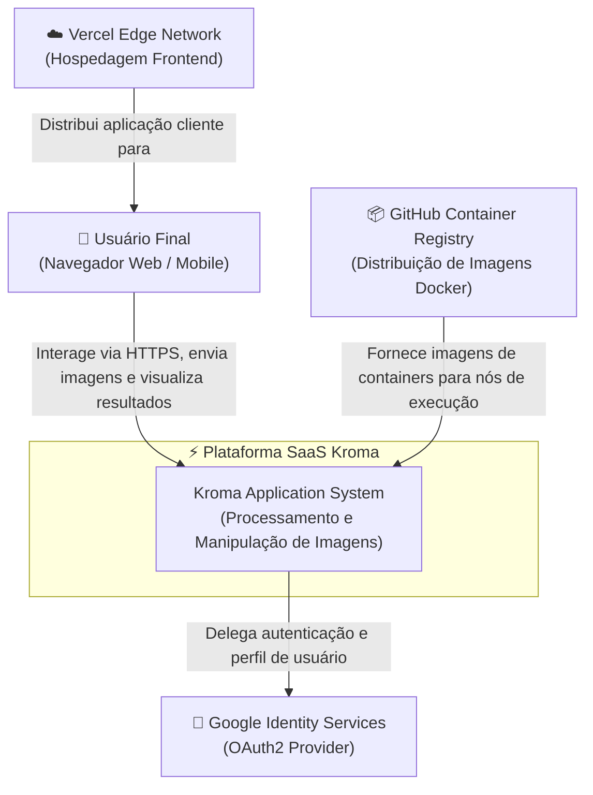
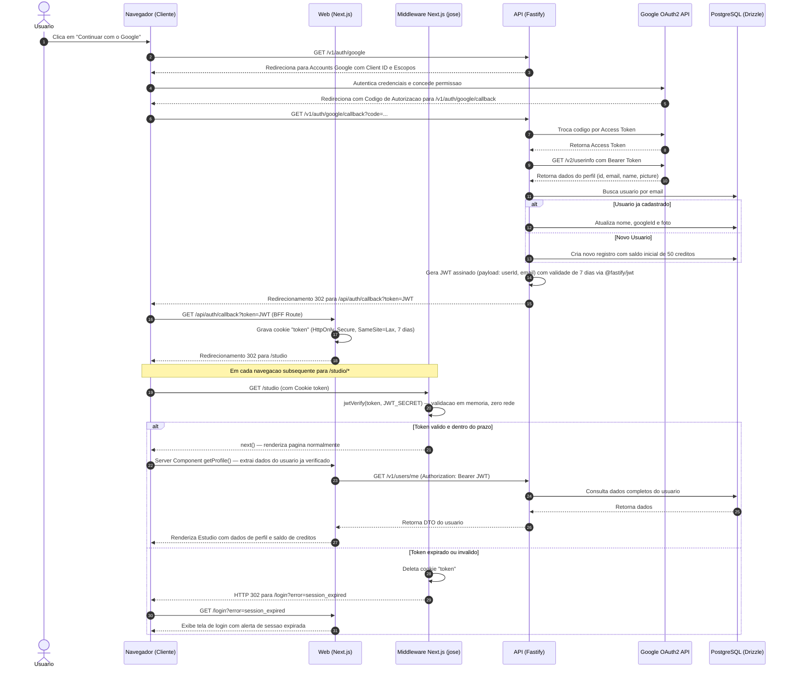
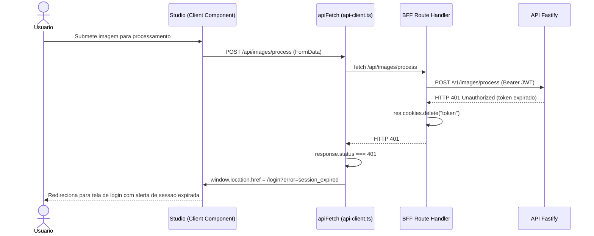
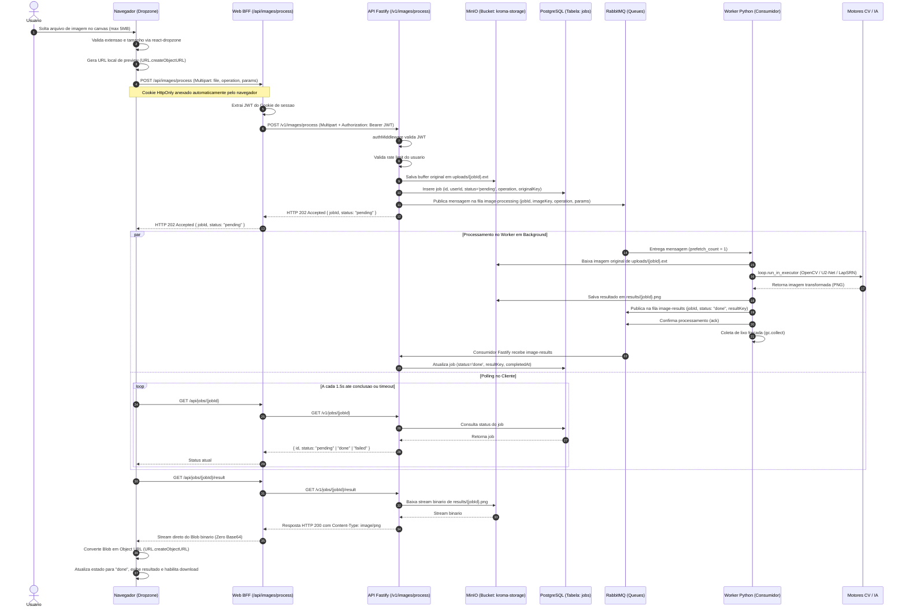
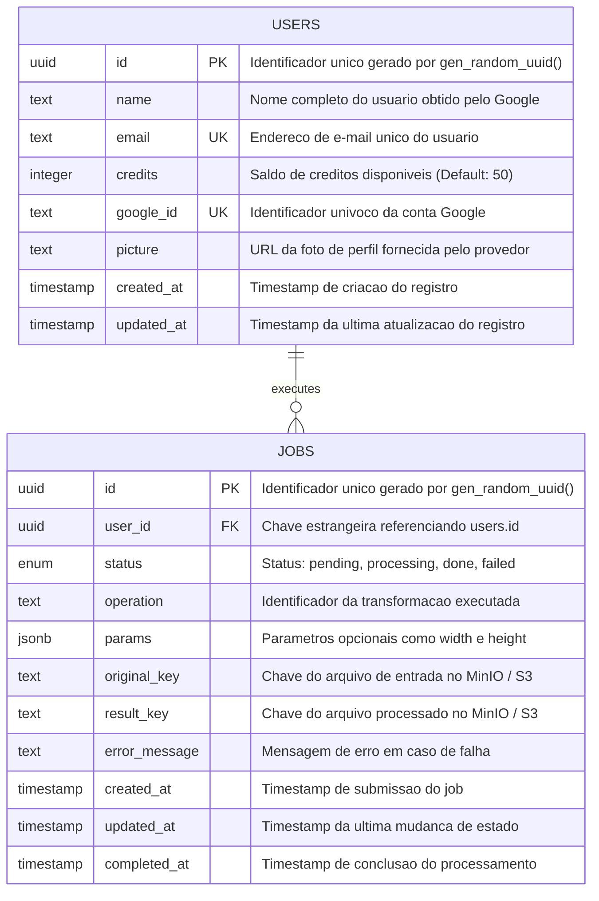
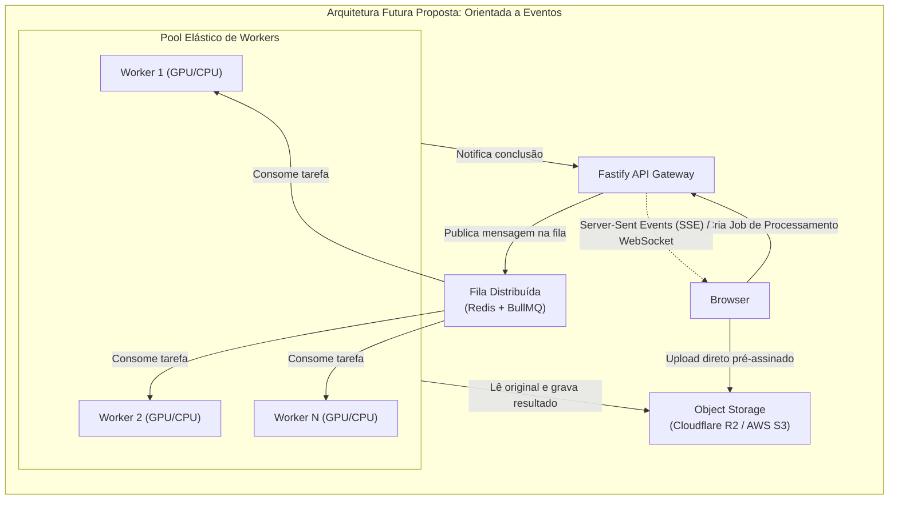

# Documento de Arquitetura do Sistema (Architecture Overview)

Este documento apresenta a especificação técnica detalhada e abrangente da arquitetura do ecossistema **Kroma**, uma plataforma SaaS orientada ao processamento, aprimoramento e manipulação de imagens por meio de Visão Computacional e Inteligência Artificial.

O objetivo deste documento é servir como a **única fonte da verdade (SSOT)** para engenheiros de software, arquitetos e agentes autônomos, detalhando os princípios de design, padrões estruturais, comunicação entre serviços, ciclo de vida de dados, pipelines de CI/CD e requisitos não funcionais que sustentam o produto.

---

## 1. Visão Geral e Propósito do Sistema

O **Kroma** foi projetado para fornecer um estúdio de edição de imagens com velocidade de nível profissional, foco na experiência do usuário e alta fidelidade visual. A aplicação combina manipulações clássicas de visão computacional (redimensionamento de alta fidelidade, filtros de cor, ajustes de nitidez) com modelos profundos de aprendizado de máquina (remoção de plano de fundo e super-resolução por IA).

### 1.1. Principais Diretrizes Arquiteturais
- **Segregação de Responsabilidades (SoC):** Separação estrita entre o roteamento/orquestração de regras de negócio em Node.js e o processamento intensivo de matrizes e tensores numéricos em Python.
- **Resiliência a Travamento de Event Loop:** Nenhuma computação pesada de pixels é executada na camada Node.js, garantindo que o Gateway de API mantenha latência milimétrica em I/O.
- **Proteção contra Falhas por Exaustão de Memória (OOM):** Controle estrito de concorrência via semáforos assíncronos no motor Python, assegurando que o consumo de RAM permaneça estável sob cargas severas.
- **Eficiência de Payload de Rede:** Eliminação de codificação/decodificação Base64 redundante em trânsito; transferência direta de streams binários (`Blob` / `Buffer` / `image/png`) de ponta a ponta.
- **Segurança Defensiva em Camadas:** Autenticação delegada via Google OAuth2, isolamento de credenciais no navegador através de cookies `HttpOnly` e autorização por tokens JWT nas fronteiras entre serviços.

---

## 2. Estrutura do Monorepo

O repositório é organizado no formato monorepo utilizando **pnpm workspaces** para o ecossistema JavaScript/TypeScript e **uv** para o ambiente Python.

```text
[Project Root]
├── .docker/                            # Armazenamento local persistente para containers de desenvolvimento
│   └── postgres/                       # Volume local do banco PostgreSQL
├── .github/                            # Automação de CI/CD e governança de código
│   └── workflows/
│       ├── ci.yml                      # Testes automatizados, linting e deploy na Vercel
│       └── release-docker.yml          # Build e publicação de contêineres no GHCR por tags (v*)
├── .agents/                            # Habilidades especializadas e manuais para agentes de engenharia
├── apps/
│   ├── web/                            # Aplicação Frontend & Camada BFF (Next.js 16 App Router)
│   │   ├── public/                     # Assets estáticos, ícones de redes sociais e tipografia
│   │   ├── src/
│   │   │   ├── app/                    # Rotas do Next.js (App Router)
│   │   │   │   ├── (public)/login/     # Fluxo de login e interface de boas-vindas
│   │   │   │   ├── (protected)/studio/ # Editor, layout do estúdio e rotas dinâmicas de ferramentas
│   │   │   │   │   ├── [tool]/page.tsx # Roteamento dinâmico baseado no slug da ferramenta
│   │   │   │   │   ├── resize/page.tsx # Página especializada em proporções de aspecto
│   │   │   │   │   └── _components/    # Seções especializadas do editor (sidebar, header, canvas)
│   │   │   │   ├── api/                # Handlers de rota BFF (Backend-for-Frontend)
│   │   │   │   │   ├── auth/callback/  # Coleta de token e persistência em cookie seguro
│   │   │   │   │   └── images/process/ # Proxy reverso de streaming binário para a API Fastify
│   │   │   │   ├── globals.css         # Variáveis de tema e estilos fundamentais do Design System
│   │   │   │   └── layout.tsx          # Shell raiz da aplicação
│   │   │   ├── components/             # Primitivas de UI acessíveis (baseadas em Radix UI / Shadcn)
│   │   │   ├── contexts/               # Provedores React de contexto global (UserContext)
│   │   │   ├── hooks/                  # Custom hooks utilitários (responsividade e mobile)
│   │   │   ├── lib/                    # Configurações de domínio (tools.ts, resizes.ts, socials.ts)
│   │   │   ├── resources/              # Serviços de comunicação do cliente e do servidor (auth, image, user)
│   │   │   └── middleware.ts           # Interceptor de segurança de rotas do Next.js
│   │   ├── Dockerfile                  # Containerização de produção Standalone
│   │   └── package.json                # Dependências do frontend
│   │
│   ├── api/                            # Gateway de Negócios e Orquestrador (Fastify 5 + TypeScript)
│   │   ├── src/
│   │   │   ├── config/                 # Módulos de configuração desacoplados (CORS, JWT, Rate-limit, OAuth)
│   │   │   ├── controllers/            # Controladores HTTP (User, Auth, Image)
│   │   │   ├── database/               # Camada de persistência Drizzle ORM
│   │   │   │   ├── migrations/         # Arquivos de migração SQL versionados
│   │   │   │   ├── schema/             # Definição tipada de tabelas (users.schema.ts)
│   │   │   │   ├── connection.ts       # Pool de conexões do driver postgres-js
│   │   │   │   └── index.ts            # Ponto de exportação do cliente de dados
│   │   │   ├── factories/              # Injeção de dependências e fábricas de casos de uso
│   │   │   ├── middlewares/            # Interceptores de autenticação (auth.middleware.ts)
│   │   │   ├── models/                 # Tipos de domínio inferidos e DTOs
│   │   │   ├── repositories/           # Implementações e contratos de acesso ao banco (Repository Pattern)
│   │   │   ├── routes/                 # Registro modular de rotas REST
│   │   │   ├── usecases/               # Casos de uso de aplicação isolados (Clean Architecture)
│   │   │   └── server.ts               # Ponto de entrada, plugins Fastify e encerramento gracioso
│   │   ├── Dockerfile                  # Build multi-stage Alpine para produção
│   │   ├── drizzle.config.ts           # Configuração de migração e Drizzle Studio
│   │   └── vitest.config.ts            # Configuração de suíte de testes de unidade
│   │
│   └── worker-image/                   # Motor Especializado de Computação Visual (Python 3.11 + FastAPI)
│       ├── app/
│       │   ├── processor/              # Algoritmos de visão computacional e pipelines de IA
│       │   │   ├── color.py            # Modificadores cromáticos e saturação
│       │   │   ├── effects.py          # U2-Net (rembg), cartoon, desenho a lápis, pintura a óleo
│       │   │   ├── enhance.py          # Unsharp Mask e filtros de nitidez
│       │   │   ├── resize.py           # Redimensionamento adaptativo Lanczos
│       │   │   ├── transform.py        # Espelhamento e transformações afins
│       │   │   └── upscale.py          # Super-resolução profunda via LapSRN (x2 e x4)
│       │   ├── services/
│       │   │   └── image_service.py    # Dicionário de despacho e roteamento de operações
│       │   ├── utils/
│       │   │   └── image_loader.py     # Decodificação segura de bytes para imagens PIL/OpenCV
│       │   └── main.py                 # Servidor FastAPI, semáforo de concorrência e lifecycle
│       ├── scripts/
│       │   └── download_models.py      # Automação de download dos modelos pré-treinados
│       ├── Dockerfile                  # Container otimizado com modelos pré-embarcados
│       └── pyproject.toml              # Declaração do projeto Python gerenciado via uv
├── packages/
│   └── shared/                         # Contratos compartilhados (@kroma/shared)
│       ├── src/
│       │   ├── types/
│       │   │   ├── user.ts             # Contratos de Usuário e DTOs
│       │   │   ├── image.ts            # Operações de imagem e interfaces
│       │   │   └── job.ts              # Contratos de Jobs (JobDTO, JobStatus, CreateJobResponse)
│       │   └── index.ts                # Barrel export
│       └── package.json
├── docs/                               # Documentação técnica e manuais de engenharia
│   └── architecture.md                 # Este documento de arquitetura
├── AGENTS.md                           # Orientações operacionais para agentes de IA
├── docker-compose.yml                  # Orquestração do ambiente completo de infraestrutura local
└── package.json                        # Scripts globais do monorepo
```

---

## 3. Diagramas Arquiteturais de Alto Nível

### 3.1. C4 Model - Nível 1: Diagrama de Contexto de Sistema

Este diagrama ilustra o posicionamento da plataforma Kroma em relação aos usuários finais e atores externos integrados.



---

### 3.2. C4 Model - Nivel 2: Diagrama de Conteineres

Detalhamento dos componentes de software que formam a arquitetura interna do Kroma, seus protocolos de comunicacao e responsabilidades de execucao.

```mermaid
flowchart TB
    Client["Navegador do Cliente\n[React 19 / Client Components]"]

    subgraph WebBoundary ["apps/web - Camada de Apresentacao e BFF (Next.js 16)"]
        Pages["App Router (SSR e Static Pages)\n[/studio, /login, /profile]"]
        BFFAuth["Route Handler: /api/auth/callback\n[Gerencia Cookies HttpOnly]"]
        BFFProcess["Route Handler: /api/images/process\n[Enfileira Job - Retorna 202]"]
        BFFJobs["Route Handlers: /api/jobs/[id]/*\n[Polling de Status e Stream de Resultado]"]
    end

    subgraph APIBoundary ["apps/api - Gateway de Regras e Orquestracao (Fastify 5)"]
        AuthModule["Modulo de Autenticacao\n(OAuth2 + Emissao de JWT)"]
        UserModule["Modulo de Usuarios\n(Gestao de Contas e Creditos)"]
        ImageModule["Modulo de Imagens e Jobs\n(Upload S3, Enfileiramento RabbitMQ)"]
        ResultsConsumer["Consumidor de Resultados\n(Atualiza status no PostgreSQL)"]
        FastifyCore["Fastify Engine\n(PreHandler AuthMiddleware, Zod Provider)"]
    end

    subgraph MessageBroker ["RabbitMQ 3"]
        QueueProcessing[("Fila: image-processing\n[Durable, Persistent]")]
        QueueResults[("Fila: image-results\n[Durable, Persistent]")]
    end

    subgraph ObjectStorage ["MinIO / S3 Storage"]
        BucketStorage[("Bucket: kroma-storage\n[uploads/* e results/*]")]
    end

    subgraph WorkerBoundary ["apps/worker-image - Motor Cientifico (Python 3.11 / FastAPI)"]
        QueueConsumer["Consumidor aio-pika\n(Prefetch Count = 1)"]
        ImageService["Image Dispatch Service\n(Roteamento por Tipo de Operacao)"]
        CVAlgorithms["Algoritmos de Visao Classica\n(OpenCV, NumPy, PIL)"]
        AIInference["Motores de Inferencia Neural\n(U2-Net ONNX + LapSRN DNN)"]
    end

    subgraph DatabaseBoundary ["Camada de Persistencia"]
        PostgresDB[("Banco de Dados Relacional\nPostgreSQL 17\n(Tabelas: users, jobs)")]
    end

    Client -->|"Navegacao e UI"| Pages
    Client -->|"Inicia fluxo de login"| BFFAuth
    Client -->|"Submete Multipart FormData"| BFFProcess
    Client -->|"Polling de status e download"| BFFJobs

    BFFAuth -->|"Valida codigo e perfil"| AuthModule
    BFFProcess -->|"POST /v1/images/process"| ImageModule
    BFFJobs -->|"GET /v1/jobs/:id e /result"| ImageModule
    Pages -->|"GET /v1/users/me (SSR)"| UserModule

    FastifyCore --- AuthModule
    FastifyCore --- UserModule
    FastifyCore --- ImageModule
    FastifyCore --- ResultsConsumer

    UserModule -->|"Drizzle ORM / SQL"| PostgresDB
    AuthModule -->|"Drizzle ORM / SQL"| PostgresDB
    ImageModule -->|"Drizzle ORM / SQL"| PostgresDB
    ResultsConsumer -->|"Drizzle ORM / SQL"| PostgresDB

    ImageModule -->|"Salva imagem original (uploads/)"| BucketStorage
    ImageModule -->|"Publica job de processamento"| QueueProcessing
    ImageModule -->|"Download do resultado final (results/)"| BucketStorage

    QueueConsumer -->|"Consome mensagens (prefetch=1)"| QueueProcessing
    QueueConsumer -->|"Baixa imagem original"| BucketStorage
    QueueConsumer -->|"Despacha via ThreadPool"| ImageService
    ImageService -->|"Executa"| CVAlgorithms
    ImageService -->|"Executa"| AIInference
    QueueConsumer -->|"Salva imagem processada (results/)"| BucketStorage
    QueueConsumer -->|"Publica status finalizado"| QueueResults

    ResultsConsumer -->|"Consome status concluido/falha"| QueueResults
```



---

### 3.3. Diagrama de Sequencia: Autenticacao Segura de Ponta a Ponta

Fluxo detalhado da autenticacao via Google OAuth2, geracao de sessao delegada e garantia de isolamento do token no navegador via cookie protegido.



### 3.3.1. Interceptacao de 401 em Requisicoes do Cliente (apiFetch)

Durante uma sessao ativa no Studio, todas as requisicoes client-side passam pelo wrapper `apiFetch` em `src/lib/api-client.ts`. Caso qualquer rota BFF retorne HTTP 401 (por exemplo, se o token expirar durante a navegacao SPA entre ferramentas):



---

### 3.4. Diagrama de Sequencia: Processamento Assincrono com RabbitMQ e MinIO

Fluxo assincrono desacoplado com Storage de Objetos e Mensageria, eliminando bloqueios de conexao HTTP e mantendo integridade binaria de ponta a ponta.



---

## 4. Detalhamento dos Componentes Centrais

### 4.1. Camada Frontend & BFF (`apps/web`)

Construído sobre o ecossistema moderno do **Next.js 16 (App Router)** e **React 19**, utilizando **Tailwind CSS v4** e primitivas de acessibilidade do **Radix UI**.

- **Padrão Backend-for-Frontend (BFF):**
  - O frontend atua não apenas como cliente de renderização, mas como uma camada de segurança e adaptação de protocolos.
  - As rotas em `src/app/api/*` interceptam o ciclo de autenticação e mascaram os tokens de segurança. Os tokens JWT nunca são persistidos em `localStorage` ou `sessionStorage`, eliminando completamente o risco de exfiltração de credenciais via ataques XSS (*Cross-Site Scripting*).
  - O manipulador `src/app/api/images/process/route.ts` recebe os dados do formulário do cliente, injeta o token Bearer recuperado do cookie seguro e atua como um proxy reverso com streaming de resposta.

- **Arquitetura de Sessão em Duas Camadas:**

  **Camada 1 — Middleware Criptográfico (`src/middleware.ts` + `src/lib/jwt.ts`):**
  - Toda navegação para rotas sob `/studio/*` atravessa o middleware Next.js antes de alcançar qualquer Server Component ou Route Handler.
  - O middleware utiliza a biblioteca `jose` para executar `jwtVerify(token, JWT_SECRET)` inteiramente em memória (< 1ms). A mesma chave simétrica usada pelo Fastify para assinar o JWT (`@fastify/jwt`) é lida pela variável de ambiente `JWT_SECRET` no Next.js.
  - Se o token estiver ausente, expirado (`exp`) ou com assinatura inválida, o middleware:
    1. Remove o cookie `token` via `response.cookies.delete("token")`.
    2. Redireciona para `/login?error=session_expired` com HTTP 302.
  - Zero requisições de rede ao Fastify para verificação de sessão em transições de página. O custo é puramente computacional e desprezível.
  - Garante que sessões zumbi (cookie presente, token expirado) sejam interceptadas na borda, mesmo em transições SPA do App Router.

  **Camada 2 — Interceptor HTTP do Cliente (`src/lib/api-client.ts`):**
  - Todas as requisições client-side originadas de componentes do Studio (`"use client"`) passam pelo wrapper `apiFetch` em vez do `fetch` nativo.
  - Se qualquer rota BFF retornar `HTTP 401 Unauthorized` (janela de expiração de token durante sessão ativa ou token inválido que passou pelo middleware), `apiFetch` executa `window.location.href = "/login?error=session_expired"` imediatamente.
  - Os Route Handlers BFF (`/api/images/process`, `/api/jobs/[id]`, `/api/jobs/[id]/result`) deletam o cookie `token` antes de retornar o 401 ao cliente, garantindo limpeza completa do estado.
  - Nenhum componente React do Studio precisa tratar `UNAUTHORIZED` individualmente. A responsabilidade é totalmente centralizada.

- **Fluxo de Validação de Sessão no Server Component (após Middleware):**
  - O `StudioLayout` (`src/app/(protected)/studio/layout.tsx`) chama `getProfile()` do `auth.service.ts`.
  - `getProfile()` executa uma segunda verificação local com `verifySessionToken(token)` antes de fazer o `fetch` para `/v1/users/me` no Fastify. Tokens já expirados são rejeitados em memória, evitando uma chamada de rede desnecessária.
  - Se `getProfile()` retornar `null` (por qualquer motivo), o layout executa `redirect("/login?error=session_expired")` via `next/navigation`.

- **Otimização de Memória e Transporte Binário:**
  - Em versões legadas ou soluções ingênuas de edição de imagem, utiliza-se comumente strings em Base64. A representação em Base64 introduz uma sobrecarga de ~33% em tamanho de payload e consome ciclos pesados de CPU no navegador para codificação e decodificação de strings massivas.
  - No Kroma, a camada de transporte opera exclusivamente com **blobs binários puros**. A resposta da API é encapsulada em um `Blob` do navegador e convertida em um identificador de memória volátil via `URL.createObjectURL(blob)`. Quando o usuário limpa o canvas ou substitui a imagem, invoca-se explicitamente `URL.revokeObjectURL()` para desalocação imediata da memória gráfica.

- **Catálogo de Ferramentas e Presets:**
  - O sistema define uma matriz de operações estruturadas em `src/lib/tools.ts`, `src/lib/resizes.ts` e `src/lib/socials.ts`.

  - São suportadas 13 ferramentas dedicadas:
    1. `remove-background`: Remoção inteligente de fundo via U2-Net (10 créditos).
    2. `ai-upscale`: Super-resolução 2x baseada em rede LapSRN (5 créditos).
    3. `cartoon`: Estilização artística com quantização cromática (2 créditos).
    4. `pencil-sketch`: Simulação de desenho manual com hachuras (2 créditos).
    5. `oil-painting`: Efeito pictórico com convolução de Gabor (2 créditos).
    6. `sharpen`: Nitidez de alta frequência por Unsharp Mask (1 crédito).
    7. `grayscale`: Conversão tonal para escala de cinza (1 crédito).
    8. `blur`: Desfoque Gaussiano ajustável (1 crédito).
    9. `saturate`: Realce dinâmico do canal de saturação HSV (1 crédito).
    10. `flip-horizontal`: Espelhamento axial horizontal (1 crédito).
    11. `flip-vertical`: Inversão axial vertical (1 crédito).
    12. `sepia`: Transformação matricial vintage (1 crédito).
    13. `vignette`: Escurecimento gradiente radial das bordas (1 crédito).
  - Presets de Proporção Social com dimensões nativas para Instagram, TikTok, YouTube, LinkedIn, Pinterest, Twitter/X, Facebook e Twitch.

---

### 4.2. Camada API & Gateway de Orquestração (`apps/api`)

Implementada com **Fastify 5**, **TypeScript** e **Drizzle ORM**. O Fastify foi selecionado por apresentar desempenho significativamente superior ao Express (até 4x mais requisições por segundo e menor alocação de memória por contexto de requisição).

- **Estrutura Baseada em Clean Architecture:**
  - **Routes (`src/routes/`):** Declaração de endpoints, mapeamento de métodos e associação de schemas de validação.
  - **Controllers (`src/controllers/`):** Recepção de requisições, extração de parâmetros e serialização da resposta de saída.
  - **Usecases (`src/usecases/`):** Encapsulamento estrito das regras de negócio. Totalmente desacoplados de frameworks de transporte (não conhecem `FastifyRequest` ou `FastifyReply`), o que permite testes unitários puros e reutilização universal.
  - **Repositories (`src/repositories/`):** Abstração de persistência implementada através do padrão *Repository Pattern* (`IUserRepository`), viabilizando a troca de infraestrutura de dados ou mockagem sem impacto nas regras de negócio.
  - **Factories (`src/factories/`):** Módulos de composição responsáveis por instanciar a cadeia de dependências de cada controlador.

- **Proteção Perimetral e Resiliência:**
  - **Taxa Limite de Requisições (@fastify/rate-limit):**
    - Escopo global: 15 requisições por minuto por IP ou ID de usuário autenticado.
    - Escopo de processamento (`/v1/images/process`): Teto rígido de **5 requisições por minuto**, prevenindo abusos e sobrecarga na fila do worker.
  - **Teto de Carga Útil (@fastify/multipart):**
    - Limite máximo estrito de **5MB** por arquivo. Requisições que excedam o valor são rejeitadas na borda antes de alocarem memória.
  - **Timeouts Estratégicos:**
    - O caso de uso `ProcessImageUseCase` configura um `AbortController` com tempo limite de **120.000 ms (2 minutos)** para cobrir tanto o processamento quanto eventuais partidas a frio (*cold starts*) de containers do worker.
  - **Encerramento Gracioso (Graceful Shutdown):**
    - Utilização de `close-with-grace` para interceptar sinais do sistema operacional (`SIGINT`, `SIGTERM`), aguardando o encerramento das requisições em trânsito e fechando o pool de conexões com o PostgreSQL antes do encerramento do processo.

---

### 4.3. Motor de Processamento Cientifico e IA (`apps/worker-image`)

Servico desenvolvido em **Python 3.11** utilizando **aio-pika**, **FastAPI**, **boto3**, **Uvicorn**, **OpenCV (contrib headless)**, **Pillow (PIL)**, **rembg** e **NumPy**.

- **Estrategia de Concorrencia Orientada a Mensageria (OOM Prevention):**
  - O processamento de imagens e redes neurais consome grandes matrizes tridimensionais na memoria RAM.
  - Para garantir estabilidade absoluta, o worker opera como um consumidor assincrono do RabbitMQ com prefetch unitario:
    ```python
    await channel.set_qos(prefetch_count=1)
    ```
  - **Desacoplamento por Fila:** O RabbitMQ retem requisicoes excedentes na fila `image-processing`. O worker apenas puxa a proxima mensagem apos concluir o processamento da anterior e enviar o `ack()`. Isso substitui o bloqueio de conexoes HTTP e permite escalabilidade horizontal trivial (basta instanciar novos containers do worker).
  - **Execucao Desacoplada da Thread Principal:** Como a manipulacao de matrizes do OpenCV e a inferencia de IA sao operacoes que bloqueiam a CPU (*CPU-bound*), elas nao sao executadas no event loop assincrono. O worker delega a tarefa a um pool de threads nativo via:
    ```python
    loop = asyncio.get_running_loop()
    output_bytes = await loop.run_in_executor(
        None,
        _execute_processing,
        image_bytes,
        operation,
        params,
    )
    ```
  - **Limpeza Agressiva de Memoria:** Ao final de cada ciclo de processamento no bloco `finally`, invoca-se explicitamente o coletor de lixo do Python (`gc.collect()`), devolvendo blocos de memoria nao referenciados ao sistema operacional.

- **Ciclo de Vida de Modelos (Lazy Loading & Descarregamento Dinamico):**
  - O modelo de remocao de plano de fundo **U2-Net** (~170MB de tensores ONNX) e os modelos de super-resolucao **LapSRN** (~1MB a ~4MB) utilizam o padrao de *Carregamento Sob Demanda*.
  - A instancia do modelo so e inicializada na primeira vez em que a operacao e solicitada.
  - As rotas contam com a opcao `unload_after=True`. Quando ativado, os ponteiros globais de sessao (`_session` e `_sr_instance`) sao zerados e a memoria e limpa imediatamente apos a geracao do resultado, viabilizando arquiteturas de escala zero (*Scale-to-Zero*) em ambientes de nuvem serverless/containers.

- **Destaques dos Algoritmos de Visao e Efeitos:**
  - **Cartoon Avancado:** Combinacao de filtro bilateral (`cv2.bilateralFilter`) para atenuacao de textura com preservacao de arestas; quantizacao de cores acelerada atraves de miniatura com **K-Means** e projecao via **KDTree** (`scipy.spatial.cKDTree`); elevacao de saturacao no espaco de cores HSV em 40%; e mascara de contornos por limiarizacao adaptativa (`cv2.adaptiveThreshold`).
  - **Pencil Sketch (Desenho a Lapis Realista):** Aplicacao da tecnica classica de fusao *Color Dodge* (inversao da escala de cinza e divisao pelo desfoque Gaussiano invertido); contraste adaptativo CLAHE; injecao de 5 camadas de hachura direcional em angulos distintos (30°, 60°, 80°, 120°, 150°); e fusao textural de micro-ruido de grafite e granulacao de papel artesanal.
  - **Oil Painting (Pintura a Oleo):** Suavizacao pictorica inicial; filtro especializado `cv2.xphoto.oilPainting`; adicao de pinceladas anisotropicas direcionais atraves de convolucoes com **filtros de Gabor**; redistribuicao tonal no espaco de cores perceptual **LAB**; e compressao de realces para conferir peso de tinta oleo.

---

## 5. Armazenamento de Dados e Modelagem

A persistencia do ecossistema e centralizada no **PostgreSQL 17**, gerenciado atraves do **Drizzle ORM** com tipagem estatica e suporte a migracoes deterministicas.

### 5.1. Configuracao do Pool de Conexoes (`apps/api/src/config/database.config.ts`)
- **Driver:** `postgres` (postgres-js).
- **Tamanho Maximo do Pool (`max`):** 10 conexoes simultaneas por instancia de API.
- **Tempo Limite de Ociosidade (`idle_timeout`):** 20 segundos antes do encerramento de conexao ociosa.
- **Tempo Limite de Conexao (`connect_timeout`):** 10 segundos.

---

### 5.2. Diagrama Entidade-Relacionamento (ERD)



---

### 5.3. Detalhamento dos Schemas

#### Tabela `users` (`apps/api/src/database/schema/users.schema.ts`)

| Campo | Tipo SQL | Modificadores | Descricao de Dominio |
| :--- | :--- | :--- | :--- |
| `id` | `uuid` | `PRIMARY KEY`, `DEFAULT gen_random_uuid()` | Chave primaria canonica |
| `name` | `text` | `NOT NULL` | Nome completo do usuario |
| `email` | `text` | `NOT NULL`, `UNIQUE` | E-mail corporativo ou pessoal |
| `credits` | `integer` | `NOT NULL`, `DEFAULT 50` | Moeda interna para consumo de processamento |
| `google_id` | `text` | `NOT NULL`, `UNIQUE` | ID estavel de autenticacao federada |
| `picture` | `text` | `NOT NULL` | Link publico do avatar do Google |
| `created_at` | `timestamp` | `NOT NULL`, `DEFAULT now()` | Registro de auditoria temporal |
| `updated_at` | `timestamp` | `NOT NULL`, `DEFAULT now()` | Atualizacao de auditoria temporal |

#### Tabela `jobs` (`apps/api/src/database/schema/jobs.schema.ts`)

| Campo | Tipo SQL | Modificadores | Descricao de Dominio |
| :--- | :--- | :--- | :--- |
| `id` | `uuid` | `PRIMARY KEY`, `DEFAULT gen_random_uuid()` | Identificador unico do job assincrono |
| `user_id` | `uuid` | `NOT NULL`, `REFERENCES users(id) ON DELETE CASCADE` | Proprietario do job |
| `status` | `job_status` | `NOT NULL`, `DEFAULT 'pending'` | Enum: `pending`, `processing`, `done`, `failed` |
| `operation` | `text` | `NOT NULL` | Operacao de transformacao |
| `params` | `jsonb` | `NULLABLE` | Dimensoes e parametros adicionais |
| `original_key` | `text` | `NOT NULL` | Caminho do objeto original no bucket S3 |
| `result_key` | `text` | `NULLABLE` | Caminho do resultado final no bucket S3 |
| `error_message` | `text` | `NULLABLE` | Descricao textual da falha |
| `created_at` | `timestamp` | `NOT NULL`, `DEFAULT now()` | Momento da submissao |
| `updated_at` | `timestamp` | `NOT NULL`, `DEFAULT now()` | Ultima alteracao de status |
| `completed_at` | `timestamp` | `NULLABLE` | Momento da finalizacao |

---

### 5.4. Ciclo de Vida de Migracoes
As migracoes sao gerenciadas pelo `drizzle-kit`:
- `0000_worried_dazzler.sql`: Estrutura inicial da tabela `users` com restricoes de unicidade em `email` e `google_id`.
- `0001_nasty_lady_ursula.sql`: Adicao da coluna de monetizacao/saldo `credits` com valor padrao `0`.
- `0002_nappy_outlaw_kid.sql`: Criacao do tipo enum `job_status` e da tabela relacional `jobs` associada a `users`.

---

### 5.3. Detalhamento do Schema (`apps/api/src/database/schema/users.schema.ts`)

| Campo | Tipo SQL | Modificadores | Descrição de Domínio |
| :--- | :--- | :--- | :--- |
| `id` | `uuid` | `PRIMARY KEY`, `DEFAULT gen_random_uuid()` | Chave primária canônica |
| `name` | `text` | `NOT NULL` | Nome completo do usuário |
| `email` | `text` | `NOT NULL`, `UNIQUE` | E-mail corporativo ou pessoal |
| `credits` | `integer` | `NOT NULL`, `DEFAULT 50` | Moeda interna para consumo de processamento |
| `google_id` | `text` | `NOT NULL`, `UNIQUE` | ID estável de autenticação federada |
| `picture` | `text` | `NOT NULL` | Link público do avatar do Google |
| `created_at` | `timestamp` | `NOT NULL`, `DEFAULT now()` | Registro de auditoria temporal |
| `updated_at` | `timestamp` | `NOT NULL`, `DEFAULT now()` | Atualização de auditoria temporal |

---

### 5.4. Ciclo de Vida de Migrações
As migrações são gerenciadas pelo `drizzle-kit`:
- `0000_worried_dazzler.sql`: Estrutura inicial da tabela `users` com restrições de unicidade em `email` e `google_id`.
- `0001_nasty_lady_ursula.sql`: Adição da coluna de monetização/saldo `credits` com valor padrão `0` (sobrescrito para 50 na criação de novos usuários no caso de uso `GoogleAuthUseCase`).

Comandos operacionais:
- Geração de migrações por diff do schema: `pnpm db:generate`
- Execução de migrações pendentes: `pnpm db:migrate`
- Inspeção visual de dados via Web: `pnpm db:studio`

---

## 6. Integrações Externas & Serviços de Terceiros

| Serviço / Provedor | Tipo de Integração | Protocolo | Finalidade no Sistema |
| :--- | :--- | :--- | :--- |
| **Google Identity Services** | OAuth 2.0 Authorization Code Flow | HTTPS / REST / JSON | Autenticação unificada de usuários, validação de e-mail e recuperação de foto e nome |
| **Vercel** | Plataforma de Hospedagem Edge | Git Integration & CLI Deploy | Hospedagem em escala global da aplicação Next.js com CDN e otimização de borda |
| **GitHub Container Registry (GHCR)** | Registro OCI de Imagens Docker | Docker Registry v2 API | Armazenamento seguro e versionado dos contêineres Docker da API e do Worker |
| **Azure Container Apps / ECS** (Alvo) | Orquestração de Contêineres | Docker / HTTP Health Probes | Ambiente recomendado para a hospedagem do Worker com capacidade de escala horizontal e escala a zero |

---

## 7. Infraestrutura, DevOps & CI/CD

A infraestrutura é orientada a contêineres imutáveis e automações via **GitHub Actions**.

### 7.1. Fluxos de Trabalho Automatizados (Workflows)

#### 1. Pipeline de Integração Contínua (`.github/workflows/ci.yml`)
- Disparado a cada `push` e `pull_request` no branch `main`.
- Utiliza `dorny/paths-filter` para isolar execuções de acordo com as pastas modificadas:
  - **Mudanças em `apps/api/**`:** Configura Node.js 22, instala pacotes com lockfile estrito (`--frozen-lockfile`), executa a suíte de testes de unidade via Vitest (`pnpm test:unit`) e compila o código TypeScript (`pnpm build`).
  - **Mudanças em `apps/web/**`:** Configura Node.js 22, instala dependências com cache otimizado de loja pnpm, valida compilação Next.js (`pnpm build`) e realiza deploy direto em ambiente de produção na Vercel (`pnpm dlx vercel --prod --yes`).
  - **Mudanças em `apps/worker-image/**`:** Configura Python 3.11, instala `uv`, sincroniza o ambiente virtual (`uv sync`) e executa o linter de alta velocidade **Ruff** (`uv run ruff check .`) e a suíte de testes com **Pytest** (`uv run pytest`).

#### 2. Pipeline de Release de Contêineres (`.github/workflows/release-docker.yml`)
- Disparado exclusivamente na criação de tags de versão (`v*`, ex: `git tag v1.0.0`) ou sob demanda via `workflow_dispatch`.
- Constrói em paralelo e publica no GHCR as imagens OCI versionadas:
  - `ghcr.io/<repo>/api:<tag>` e `ghcr.io/<repo>/api:latest`
  - `ghcr.io/<repo>/worker-image:<tag>` e `ghcr.io/<repo>/worker-image:latest`

---

### 7.2. Engenharia dos Dockerfiles

#### Worker Image (`apps/worker-image/Dockerfile`)
- **Estratégia Multi-Stage:**
  - *Stage 1 (Builder):* Base python:3.11-slim, instalacao do compilador C/C++ (gcc, g++), uso de uv para resolucao e compilacao ultra-rapida de rodas binarias (*wheels*), pre-compilacao de bytecode (python -m compileall) para eliminar latencia de cold start do interpretador Python.
  - *Pré-carregamento de Modelos:* Os modelos U2-Net e LapSRN (x2 e x4) são baixados diretamente durante o build do contêiner. Isso assegura que o contêiner inicie imediatamente sem depender de conectividade externa de rede para download em runtime.
  - *Stage 2 (Runner):* Imagem limpa sem ferramentas de compilação.
- **Configurações de Execução Otimizada:**
  - `ONNX_NUM_THREADS=1` e `OMP_NUM_THREADS=1`: Impede que bibliotecas de visão criem dezenas de threads concorrentes que competem por CPU em instâncias de nuvem com núcleos limitados.
  - Execução sob usuário restrito não-root (`appuser`), garantindo segurança contra escalonamento de privilégios.

#### API Gateway (`apps/api/Dockerfile`)
- Baseada em `node:24-alpine`.
- Build multi-stage com cache montado para o armazenamento do pnpm (`--mount=type=cache,id=pnpm,target=/pnpm/store`).
- Compilação via TypeScript e resolução de aliases de caminho com `tsc-alias`.
- Imagem final de produção enxuta contendo apenas dependências de produção e o diretório `dist/`.

#### Web (`apps/web/Dockerfile`)
- Baseada em `node:24-alpine`.
- Compilação no modo **Next.js Standalone**, que isola somente os módulos estritamente necessários para rodar o servidor, descartando o `node_modules` completo de desenvolvimento.
- Execução sob usuário de sistema sem privilégios (`nextjs`).

---

## 8. Segurança & Conformidade

A arquitetura do Kroma adota o princípio de **Defesa em Profundidade (Defense in Depth)**:

1. **Proteção de Tokens de Sessão:**
   - O JWT emitido pela API possui tempo de vida de 7 dias e é criptografado com chave simétrica via `@fastify/jwt`.
   - O cookie gravado no navegador recebe as flags:
     - `HttpOnly = true`: Impede leitura via scripts maliciosos de terceiros (`document.cookie`).
     - `Secure = true` (em produção): Garante transmissão exclusiva através de túneis TLS/HTTPS.
     - `SameSite = Lax`: Previne vulnerabilidades de CSRF (*Cross-Site Request Forgery*) em requisições de navegação cruzada.
   - **Validação Criptográfica no Middleware Next.js:** O `middleware.ts` utiliza `jose.jwtVerify` para verificar a assinatura e o campo `exp` (expiração) do token inteiramente em memória, sem chamadas de rede ao Fastify. Tokens expirados ou adulterados são rejeitados na borda em menos de 1ms, com remoção imediata do cookie e redirecionamento para `/login`.
   - **Interceptor HTTP no Cliente:** O wrapper `apiFetch` captura respostas `HTTP 401` de qualquer rota BFF durante sessões ativas no Studio, disparando limpeza de cookie e redirecionamento automático. Elimina a necessidade de tratamento manual de expiração em cada componente React.

2. **Mitigação de Abuso e Negação de Serviço (DoS):**
   - Controle de fluxo em múltiplos níveis:
     - Nível 1: Rate limiting perimetral no Fastify via @fastify/rate-limit (100 req/min global, 5 req/min para submissão gráfica, 120 req/min para polling de jobs particionado por userId ou X-Forwarded-For/IP).
     - Nível 2: Limitação física de tamanho de payload no parsing multipart (teto de 5MB).
     - Nível 3: Semáforo de controle no worker Python para contenção de uso de RAM e CPU.

3. **Validação Estrita de Dados (Input Validation):**
   - Utilização de **Zod** tanto no Fastify (via `fastify-type-provider-zod`) quanto no Next.js.
   - Qualquer payload que contenha atributos inválidos ou tipos incorretos é sumariamente rejeitado com código HTTP 400 antes de alcançar a camada de domínio.

4. **Isolamento de Contêineres:**
   - Todos os contêineres de produção executam como usuários comuns (`appuser`, `nextjs`), bloqueando a capacidade de leitura de diretórios sensíveis do host ou modificação de arquivos de sistema da imagem.

---

## 9. Ambiente de Desenvolvimento & Guia Operacional

### 9.1. Requisitos de Sistema
- Node.js versão `>= 22`
- Gerenciador de pacotes `pnpm` versão `10.24.0+`
- Python versão `>= 3.11` e `< 3.13`
- Gerenciador de pacotes Python `uv`
- Docker e Docker Compose instalados

### 9.2. Inicialização do Ambiente Local
```bash
# 1. Instalação das dependências do monorepo
pnpm install

# 2. Configuração de variáveis de ambiente do backend
cp apps/api/.env.example apps/api/.env

# 3. Inicialização da infraestrutura de banco de dados
docker-compose up -d database

# 4. Aplicação de migrações estruturais
pnpm --filter @kroma/api db:migrate

# 5. Instalação do ambiente virtual e bibliotecas do Worker
cd apps/worker-image
uv sync
cd ../..

# 6. Execução coordenada de todos os serviços (Web + API + Worker)
pnpm dev
```

### 9.4. Implantação Self-Hosted com Docker Compose
O ecossistema conta com orquestração unificada via docker-compose.yml otimizada para ambientes self-hosted:
1. Copie o arquivo de ambiente centralizado na raiz: cp .env.example .env
2. Ajuste o domínio (FRONTEND_URL, NEXT_PUBLIC_API_URL, GOOGLE_CALLBACK_URL) e segredos (JWT_SECRET, credenciais Google) no .env.
3. Inicie toda a infraestrutura com build automático: docker compose up -d --build (ou 	ask infra:all).
4. As portas dos serviços internos (PostgreSQL, RabbitMQ, MinIO, Worker) são protegidas com bind em 127.0.0.1 e volumes nomeados do Docker garantem persistência sem conflitos de permissão no Linux.

### 9.3. Portas Padrão de Desenvolvimento
| Serviço | Endereço Local | Descrição |
| :--- | :--- | :--- |
| **Web** | `http://localhost:3000` | Interface do usuário e Estúdio de edição |
| **API** | `http://localhost:8080` | Servidor Fastify e endpoints REST |
| **Scalar API Docs** | `http://localhost:8080/docs` | Documentação interativa OpenAPI do backend |
| **Worker Image** | `http://localhost:8000` | Servidor FastAPI de visão computacional |
| **PostgreSQL** | `localhost:5432` | Instância local de banco relacional |
| **Drizzle Studio** | `http://localhost:4983` | GUI interativa para gerenciamento do banco (`pnpm start:drizzle-studio`) |

---

## 10. Riscos Arquiteturais, Débitos Técnicos & Visão de Futuro

### 10.1. Débitos e Riscos Atuais

1. **Comunicação HTTP Síncrona entre API e Worker:**
   - Atualmente, a requisição de processamento permanece com a conexão HTTP aberta desde o navegador até o worker durante todo o tempo de inferência (podendo levar de 2 a 15 segundos).
   - *Impacto:* Se o tráfego aumentar repentinamente, o semáforo do worker reterá requisições e clientes receberão erros 503/504 rapidamente.
2. **Armazenamento de Imagens Volátil:**
   - As imagens processadas existem apenas como bytes transitórios no buffer da memória e são retornadas imediatamente ao usuário. Não há persistência de histórico de edições ou galeria de trabalhos anteriores.
3. **Escala de Instância Única do Worker:**
   - O worker está limitado a processar 1 imagem por vez através do semáforo local. Múltiplos workers atrás de um balanceador de carga demandam uma camada de agendamento centralizada.

---

### 10.2. Roadmap de Evolução Arquitetural (Próximos Passos)



1. **Adoção de Fila Distribuída Assíncrona (Task Queue):**
   - Introduzir **Redis** com **BullMQ** ou RabbitMQ/Celery entre a API e o Worker.
   - O upload do arquivo despacha um `job_id` instantâneo (HTTP 202 Accepted) e o cliente acompanha o progresso via polling ou WebSockets / Server-Sent Events (SSE).
2. **Armazenamento em Objeto Centralizado (Object Storage):**
   - Integração com **AWS S3** ou **Cloudflare R2** para armazenamento de originais e resultados com geração de URLs pré-assinadas (*Presigned URLs*), descarregando completamente o trânsito de bytes pesados da API de negócios.
3. **Sistema Transacional de Dedução de Créditos:**
   - Adicionar tabela `credit_transactions` para registro atômico e rastreabilidade de saldo consumido por cada operação executada com sucesso.

---

## 11. Identificação do Projeto & Metadados

- **Nome do Projeto:** Kroma (SaaS de Edição e Processamento de Imagens)
- **Organização / Monorepo:** `@kroma/web`, `@kroma/api`, `kroma-worker`
- **Ambientes Suportados:** Desenvolvimento local (Docker Compose), Produção (Vercel + GHCR / Containers em Nuvem)
- **Data da Última Atualização Arquitetural:** 2026-09-30
- **Status do Documento:** Ativo / Living Specification

---

## 12. Glossário & Acrônimos Técnicos

- **BFF (Backend for Frontend):** Padrão de arquitetura onde uma camada de servidor específica atende às necessidades exclusivas da interface do usuário (ex: gerenciamento seguro de cookies e streaming).
- **CLAHE (Contrast Limited Adaptive Histogram Equalization):** Algoritmo de equalização de histograma adaptativo limitado por contraste, utilizado para realçar texturas sem estourar ruídos.
- **DNN (Deep Neural Network):** Redes neurais profundas executadas via módulo `cv2.dnn`.
- **Drizzle ORM:** Object-Relational Mapping TypeScript-first de baixo overhead e tipagem estrita para bancos relacionais.
- **GHCR (GitHub Container Registry):** Serviço de hospedagem e distribuição de contêineres Docker integrado ao GitHub.
- **JWT (JSON Web Token):** Padrão aberto (RFC 7519) para representação compacta e segura de declarações autenticadas entre duas partes.
- **LapSRN (Laplacian Pyramid Super-Resolution Network):** Rede neural convolucional projetada para super-resolução progressiva de imagens em múltiplos fatores de escala (x2, x4).
- **LANCZOS:** Método de reamostragem e interpolação matemática de alta fidelidade para redimensionamento de imagens digitais.
- **ONNX (Open Neural Network Exchange):** Formato aberto e otimizado para representação e execução de modelos de aprendizado de máquina em diferentes aceleradores de hardware.
- **OOM (Out Of Memory):** Condição crítica em que o sistema operacional finaliza um processo que tentou alocar mais memória RAM do que a capacidade física disponível.
- **SSOT (Single Source of Truth):** Princípio de estruturação de dados e documentação em que cada elemento de informação possui uma única origem canônica.
- **U2-Net:** Arquitetura de rede neural convolucional de dois níveis (*nested U-structure*) otimizada para segmentação de objetos salientes e recorte de primeiro plano.
- **Unsharp Mask:** Algoritmo clássico de nitidez que subtrai uma versão desfocada da imagem original para destacar transições de alta frequência nas bordas.
- **uv:** Gerenciador de projetos e instalador de pacotes extremamente rápido para Python, construído em Rust.